# 2020.02.13

### 라이센스 심는 방법

- Power Debug에 새로운 Cable 연결(?)
- Powerview 실행(...arm.exe)
- `y19070272245.cmm` 실행(cmm 스크립트)


# ipconfig /all 에 대한 이해

- 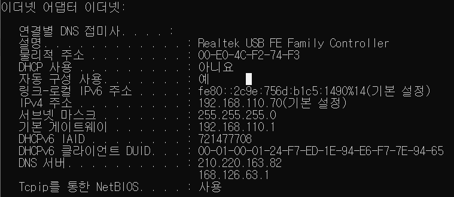

### 루프백 주소

- IP 주소 클래스 중, `A class`와 `B class` 사이에 위치한 특별한 IP 주소

- 자기가 사용하는 LAN 가드 자신을 의미

  

### 도메인 이름을 통해 IP 주소 확인하기

- `cmd` 실행

- ```bash
  C:\User\MinGi.Kim> ping trace32.com
  	#결과
       #Ping trace32.com [183.111.174.4] 32바이트 데이터 사용:
       #요청 시간이 만료되었습니다.
       #요청 시간이 만료되었습니다.
       #요청 시간이 만료되었습니다.
       #요청 시간이 만료되었습니다.
       #183.111.174..4에 대한 Ping 통계:
       #	패킷: 보냄 = 4, 받음 = 0, 손실 = 4(100% 손실)
  ```

- ```bash
  C:\User\MinGi.Kim> nslookup trace32.com
  	#결과
  	#서버:	bns1.hananet.net
  	#Address:	210.220.163.82
  	#
  	#권한 없는 응답:
  	#이름:	trace32.com
  	#Address:	183.111.174.4
  ```

---

### DNS

- Domain Name System
  - IP 네트워크에서 사용하는 시스템. 영문/한글 주소를 IP 네트워크에서 찾아갈 수 있는 IP로 변환
  - `Name Server(네임서버)` : DNS를 운영하는 서버. KT,LG,SK,CJ, ... (ISP:internet service provider)
    - naver.com 같이 네임 주소를 입력하면 DNS 서버에서 고유 ip주소로 변경하여 접속하게 된다
    - DNS 서버는 ip 주소 변환 및 보안 정책이 적용되어 있다
    - 위조된 사이트 이동을 막아주고 특정 사이트 접속을 막거나, 경고 페이지를 보여준다
    - `hosts` : 개인 PC에서도 DNS 서버와 같은 역할을 하는 파일

- DNS 서버 리스트
  - 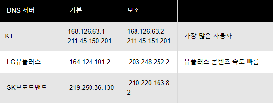


### IP

- 인터넷 공간에서 자기 PC가 사용하는 고유한 식별자
- 내 PC의 출발지 주소

- 32개의 bit
  - 4,294,967,296 = 42억
  - 8개씩 4등분 : 0.0.0.0 -> 255.255.255.255
- 모든 IP 주소는 IANA라는 기관에서 관리하고 있으면 전세계에 고루 할당되어 있다.
- 네트워크 영역(ex:192.168)과 호스트 IP(주민등록번호)로 구성되어 있다
- 동일한 네트워크 내에서 호스트 IP는 각자 달라야 한다
- 네트워크 아이디와 서브넷 브로드케스트 주소, 2가지 경우의 수를 뺀 나머지가 사용 가능한 IP 개수


### 기본 게이트 웨이(=라우터)

- 내가 사용하는 무선 공융기
- 인터넷으로 접속하기 위한 일종의 관문

- 하드웨어적 측면 = 라우터, (소프트웨어적 측면 = 게이트웨이)
- 라우터는 인터넷 공간에서 각기 다른 호스트 사이를 연결해주는 기능을 수행(라우팅:routing)
- 192.168.110.1(기본게이트웨이 예시)
  - IPv4 주소: 192.168.110.70
  - PC와 게이트웨이 사이에 설정된 `네트워크 ID`가 `192.168.110` 으로 동일
- LAN(local area network)영역 : 동일한 네트워크 ID를 공유하는 장치들의 공간
  - 네트워크 ID가 다르면 두 장치는 서로 상이한 LAN 영역에 존재하는 것
  - 학교 와이파이와 카페 와이파이
- 네트워크 ID는 무수히 많은 LAN영역을 구분하기 위한 식별자
  - 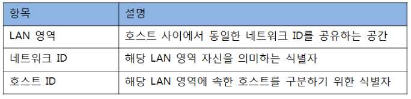

- 라우팅: 상이한 LAN 영역 사이를 연결해주는 동작
- 스위킹: 동일한 LAN 영역 사이를 연결해주는 동작


### 서브넷 마스크

- 서브넷을 만들 때 쓰이는 것, IP주소에서 네트워크 영역을 부분적으로 나눈 `부분망`
- IP 주소와 `AND` 연산하여 Network 부분의 정보를 걸러내는 것
- IP 주소 뒤에 `/24` 같은 표시는 서브넷 마스크의 bit 수를 의미한다. 클래스 C
  - `Prefix` : 서브넷 마스크 맨 앞의 비트부터 1의 개수를 표기하는 방식
- IP 클래스들의 기본 서브넷(Default Subnet)
  - 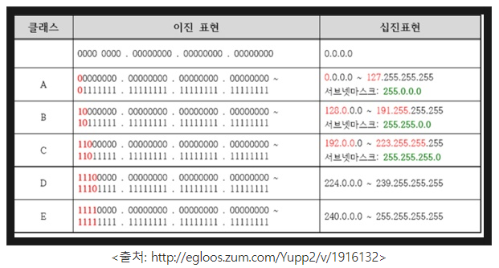

- 연속된 `1` 또는 `0`으로 구성되어 있다
- `1`이 있는 곳(=.255)은 `네트워크 주소`로, `0`이 있는 곳(=.0)은 `호스트 주소`로 사용

- 필요한 네트워크 주소만 호스트 IP로 할당할 수 있게 만들어 네트워크 낭비를 방지한다
- 서브 네팅을 위해 필요한 것
- 서브 네팅
  - 네트워크 영역과 호스트 영역을 분할하는 것
  - 네트워크 관리자가 네트워크 성능을 향상시키기 위해 자원을 효울적으로 분배하는 것

- 주소를 읽는데 구멍 뚫은 종이를 위에 대고 보는 것과 유사하다
- 한국 서울시 서초구 반포동 한신아파트 XXX"가 주소라면 한국까지만 볼건지 서초구까지 볼건지를 정하는 것이다. 국가가 미국이라면 나머지 주소는 볼것도 없이 미국으로 보내고, 한국인데 서초구라면 서초우체국에 전달하는 것 처럼 효율적인 배달을 위해 전체 주소가 아닌 상위주소만 읽고 처리할 필요가 있다.


### 네트워크 아이디(network ID)

- IP가 어떤 클래스(A,B,C,D,E)에 있고 서브넷 마스크가 있을 때, 둘을 `AND` 조건으로 곱한 결과
- 국번 : +82
- 호스트 아이디(호스트 ID): 일련번호


### 같은 네트워크 대역

- 서브넷 마스크가 동일한 경우

- 예시
  - 다른 영역: `192.168.1.0 / 255.255.255.0` vs `192.168.8.0 / 255.255.255.0`
  - 같은 네트워크 영역: `192.168.1.0 / 255.255.0.0` vs `192.168.8.0 / 255.255.0.0`


### A 클래스(A class/ Unicast Address)

- 첫 번째 필드를 2진수로 변환할 경우, 맨 앞에 `0`이라는 공통 비트를 갖는다면 A class
- 0에서 127까지 (0000,0000 ~ 0111,1111)
- A class 가 사용하는 기본 서브넷 마스크는 255.0.0.0 이며 `호스트 ID`는 24bit 이므로
- 네트워크 아이디당 나올 수 있는 IP 주소는 2^24개가 된다.(16,777,216개)
  - 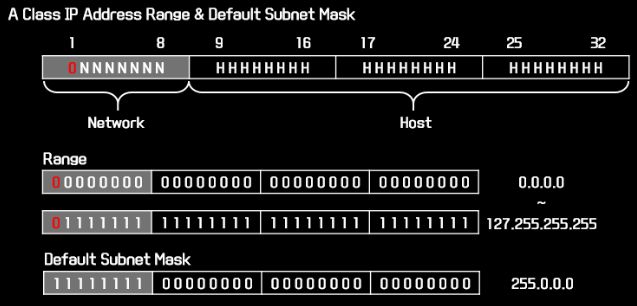


### B 클래스(B class/Unicast Address)

- 첫 번째 필드를 2진수로 변환할 경우, 맨 앞에 `10`이라는 공통 비트를 갖는다면 B class
- 128에서 191까지 (1000,0000 ~ 1011,1111)
- B class 가 사용하는 기본 서브넷 마스크는 255.255.0.0 이며 `호스트 ID`는 16bit 이므로
- 네트워크 아이디당 나올 수 있는 IP 주소는 2^16개가 된다.(65,536개)
  - 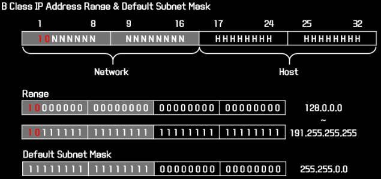


### C 클래스(C class/ Unicast Address)

- 첫 번째 필드를 2진수로 변환할 경우, 맨 앞에 `110`이라는 공통 비트를 갖는다면 c class
- 192에서 223까지 (1100,0000 ~ 1101,1111)
- C class 가 사용하는 기본 서브넷 마스크는 255.255.255.0 이며 `호스트 ID`는 8bit 이므로
- 네트워크 아이디당 나올 수 있는 IP 주소는 2^8개가 된다.(256개)
  - 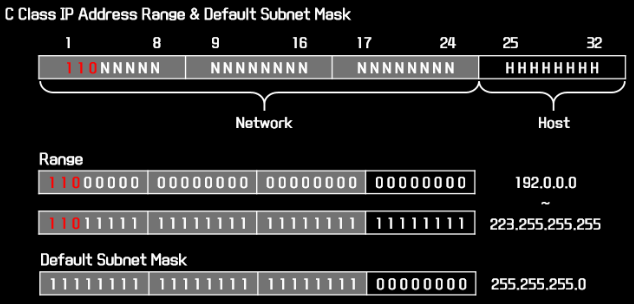


### D 클래스(D class/ Multicast Address)

- 첫 번째 필드를 2진수로 변환할 경우, 맨 앞에 `1110`이라는 공통 비트를 갖는다면 D class
- 224에서 239까지 (1110,0000 ~ 1110,1111)
- D class 는 멀티캐스트 주소로 예약되어 있으며 서브넷 마스크를 이용하여
- 블락단위로 동작하지 않으므로 서브넷 마스크를 사용하지 않는다
  - 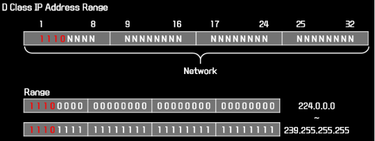


### E 클래스(E class/ Boardcas Address)

- 첫 번째 필드를 2진수로 변환할 경우, 맨 앞에 `1111`이라는 공통 비트를 갖는다면 E class
- 240에서 255까지 (1111,0000 ~ 1111,1111)
- E class는 IANA(전세계 ip 관리하는 곳)에서 사용을 제한 시킨 주소
- 네트워크 인터페이스 설정이 불가능
  - 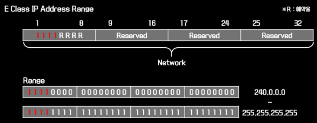


### 네트워크 이름

- 네트워크 아이디의 호스트 부분이 모두 `0`인 주소
- 네트워크를 표기하거나 라우팅 경로로 사용하기 위해서 예약된 값이 때문에 인터페이스에서 설정 불가
- 예시
  - `192.168.1.1/24` 주소의 네트워크 아이디 : `192.168.1` 
  - 마지막 `.1` 그러니까 8bit는 호스트 아이디
- 호스트 아이디 전체가 `0`인 주소, `192.168.1.0` 은 `네트워크 이름` 이 된다
- 서브넷 브로드케스트 주소
  - 네트워크 아이디의 호스트 부분이 모두 `1`인 주소
  - 네트워크에서 브로드케스트를 실시할 때 예약된 값이기 때문에 인터페이스 설정 불가
  - 예시
    - `192.168.1.1/24` 주소의 `서브넷 브로드케스트 주소`는  `192.168.1.255` 
- 따라서

- 사용하지 못하는 네트워크 아이디와 서브넷 브로드케스트 주소 2개를 뺀 나머지가
- 사용 가능한 IP 주소
- 예시
  - `192.168.1.1/24` 에서 IP 주소의 개수는 총 2^8=256개 이다.
  - 네트워크 아이디(192.168.1.0)와 서브넷 브로드케스트 주소(192.168.1.255)를 제외한
  - 2^8 -2 = 254개의 IP가 할당 가능한 IP 주소의 개수가 된다


### 공인 IP 주소

- 인터넷과 같이 공인 환경에 직접 연결이 가능한 주소
- 인터넷 사용을 위해 반드시 필요한 IP 주소
- ISP(internet service provider) 업체로 부터 임대받아서 사용


### 사설 IP 주소

- 공인 환경이 아닌 기업 내부 사설 환경에서 사용하는 권장 주소
- 인터넷과 연결되지 않기 때문에 다른 환경과 중첩하여 주소 범위를 사용해도 무관
- ISP 업체로부터 임대 받지 않아도 사용 가능
- 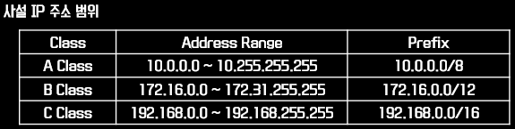
  - (WAN 구간을 연결하는 Router는 사설 IP 주소를 외부로 전송 불가)


# MAC 주소

- Media Access Control Address
- 디바이스 마다 할당된 물리적인 주소
  - 예시 : 물리주소 94-E6-F7-7E-94-66
  - 
  - 12자리 숫자로 구성
  - 앞 6자리(24bit) : 벤더(제품제조사)에 할당
  - 나머지 6자리 : 각 벤더의 제품
- 네트워크 세그먼트의 데이터 링크 계층에서 통신을 위한 네트워크 인터페이스에 할당된 고유 식별자
- MAC 주소는 이더넷과 와이파이를 포함한 대부분의 IEEE802 네트워크 기술에 주소로 사용된다
- MAC 주소는 대체로 네트워크 인터페이스 컨트롤러(NIC)의 제조업체가 할당하여 하드웨어 저장
- `이더넷 하드웨어 주소`(Ethernet Hardware Address), `하드웨어 주소`, `물리주소` 로 부른다
- 국제 IEEE 규정에 따라 표준 MAC 주소
  - 48비트
    - 첫 24비트는 OUI(Organizational Unique Identifier) 제조업체의 식별코드
    - NIC 제조업체의 정보를 파악
    - 다음 24비트는 해당 업체의 랜 카드의 정보


# TCP/IP

- Transmission Control Protocol
- 인터넷에서 가장 흔하게 많이 쓰이는 프로토콜
- Error Correction이 존재한다
- 서버에서 클라이언트에게 어떤 정보를 전송하는 상황
  - 클라이언트는 잘 받았는지 확인 메세지를 서버에게 보낸다
  - Resend를 요청하면 loss된 데이터를 다시 클라이언트에게 보낼 수 있다
- 웹페이지 전송에 사용, 인터넷 및 로컬 네트워크를 통해 통신하는 데 사용


# UDP/IP

- User Datagram Protocol
- 단방향 통신
- 서버가 클라이언트에게, 클라이언트가 서버에게 무조건 보내기만 하고 받기만 한다
- 빠른 전송이 가능하다. 오류 수정이 필요하지 않은
- 비디오, 오디오 전송에 사용(큰 용량), 온라인 게임 및 스트리밍 서비스
- TCP에서 비디오의 점 하나의 데이터를 받지 못하면 버퍼링, UDP는 무시하고 플레이


# 핑(Ping)

- 나와 상대가 통신하는 데 걸리는 평균 시간
- 네트워크로 연결된 두 호스트 사이에서 연결할 수 있는지 점검하는 진단도구
- ICMP Echo Request 패킷을 원격 IP 주소로 송신하고 ICMP 응답을 기다린다
  -  Internet Control Message Protocol


# FTP

- File Transfer Protocol 파일전송 프로토콜
- ftp 통신은 서비스를 제공하는 서버와 여기에 접속하는 클라이언트 사이에
- 두 개의 연결이 생성된다
  - 데이터 전송 제어 신호(네트워크 21번 포트)
  - 실제 데이터 전송 신호(네트워크 20번 포트)


# 포트포워딩

- Port 포트
  - 컴퓨터의 `Lan선`은 하나이지만 통신을 필요로 하는 프로그램이 다수일 경우
    - 이 다수의 프로그램을 구별할 수 있는 번호가 포트번호
  - 어떤 사용자가 웹페이지 요청을 했는지, 파일 요청을 했는지 구분하기위해 사용
  - 웹사이트 : 80번 / FTP 서비스: 21번 포트 사용
  - 클라이언트에서 요청을 하면 `서버의 OS` 는 어느 포트로 요청이 왔는지 확인 후
  - 해당 포트로 접속을 기다리는 Process에게 요청 내역을 전달
  - 예시
    - A라는 `상가`(서버)에 가서 `101호 카페`(포트)의 문을 열면 카페에 들어갈 수 있다 
- 공유기를 설치하면 공유기와 연결된 PC들은 `192.168.~` 로 시작하는 IP를 공유기로부터 부여받음
  - 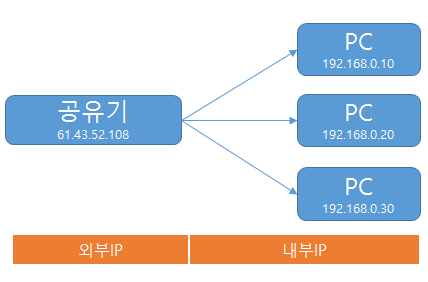
  - ISP 업체로부터 할당 받은 IP(61.43.52.108)은 공유기가 가지게 된다.
  - 공유기를 기점으로
    - 내부 IP: 공유기 뒤에 있는 PC들의 IP
    - 외부 IP: 공유기 IP
  - 회사에서 집으로 접속하는 상황
    - 집에 있는 PC(`192.168.0.20`)에 있는 파일을 가져오려면
    - 집에 있는 공유기(`61.43.52.108`)로 접속해야 한다 
    -  PC(`192.168.0.20`) 가 FTP 서비스를 실행중이라 가정
      - 21번 포트로 요청이 왔는 데 공유기는 어느 PC로 연결해야 하는지 모른다
      - 공유기에게 이정표를 달아주는 것을 포트포워딩이라 한다
- 공유기가 받은 `포트 요청`을 `내부IP` 를 연결 


# 80번 포트

- 일반적으로 웹서버는 80번 포트로 운영된다

- 80번 포트가 아닌 경우 http://www.domain.com:8080

  

# 외부 접속 방법

- ```bash
  http://IP주소:8080
  ```

  - 보통 윈도우 방화벽에서 8080포트를 차단한다
  - 제어판 방화벽 설정에서 8080 포트의 외부 접속을 추가해 주어야 한다


# 내 컴퓨터 포트번호 확인 방법

- cmd 실행

- ```bash
  C:\User\MinGi.Kim> netstat /a	# 현재 자신의 컴퓨터와 연결되거나 연결될 목록을 출력
  ```

- ```bash
  C:\User\MinGi.Kim> netstat /a	# 목록 + 연결을 기다리는 목록
  ```

- ```bash
  C:\User\MinGi.Kim> netstat /n	# 컴퓨터 이름 대신 ip주소 출력
  ```

- 