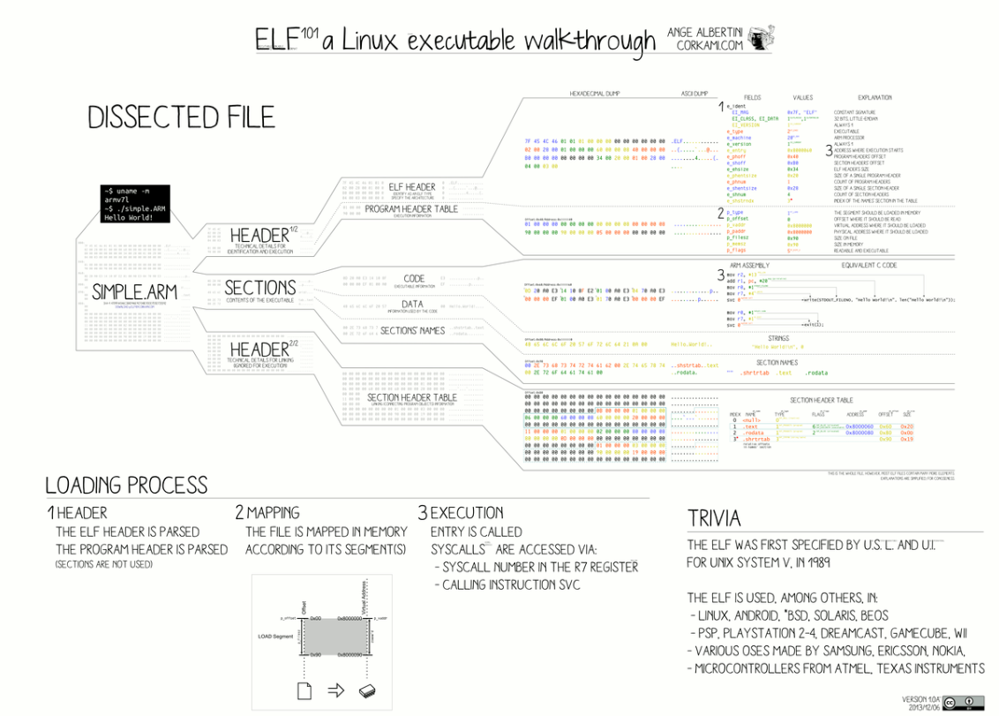
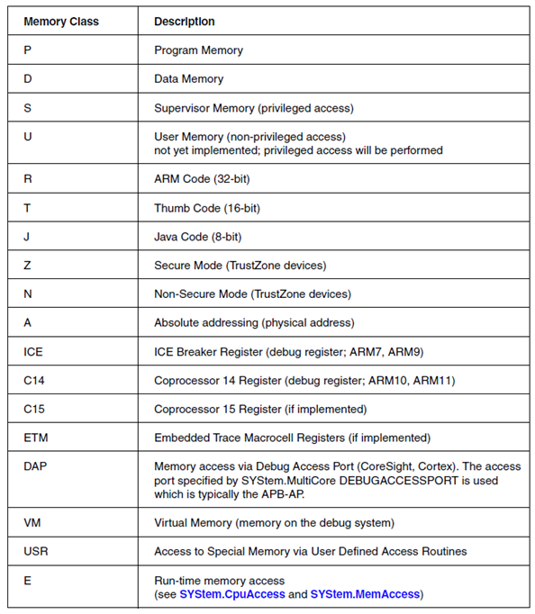
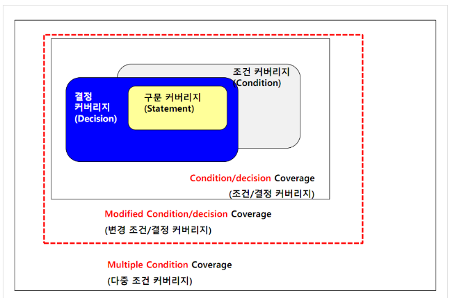
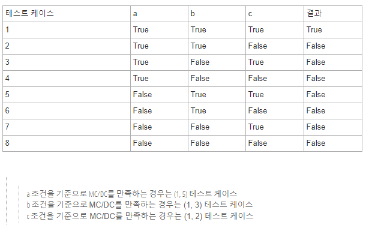

# JTAG

- Joint Test Action Group
- 디지털 회로에서 특정 노드의 디지털 입출력을 위해 직렬 통신 방식으로 출력 데이터를 전송하거나 입력데이터를 수신하는 방식을 말함
- CPU의 `기계어 코드`를 실행하지 않고 MCU 내부의 `플래시 메모리`나 임베디드 장치에서 CPU의 외부 플래시 메모리에 코드를 쓰거나 읽을 수 있다
- 디버거가 CPU 동작과 연동하여 특정 기계어 코드 위치에 멈추고 상태를 읽어 내부의 상태를 알 수 있음
- 디버깅용도
  - 하드웨어 디버거: 개발 편리, 디버깅 비용 및 사용법 숙지
    -  CPU 제어가능
  - 소포트웨어 디버거: 시리얼 포트로 메세지 출력, 비용x, printf 추가, 매번 컴파일, 플래시에 다운
- 플래시 다운로더용
  - C언어로 프로그램 후 컴파일하면 통합 바이너리 만들어짐
  - 통합 바이너리를 플래시 메모리에 다운로드하기 위해 JTAG 이용


# Elf

- `elf`는 파일 확장자가 아니라, 포맷임. 확장자는 다를 수 있음
  - elf 포맷 :ELDP.org, EFLP 사이트에서 찾아보기
  - Header Part : 32 byte 정보
  - Binary Part : Flash에 Write 되는 .bin
  - Symbol Part: Trace32 디버깅 시 에 사용되는 symbol 정보
  - `elf Strip` : elf 파일에서 Symbol Part를 떼어 냄
- Flash Write
  - 기본적으로 Write 불가능
  - Write 하기 위해서는 FLASH Program 가능하도록 Command가 필요
  - cmd는 Flash마다 다르므로 data sheet를 참조한다

- 

  

- Executable and Linkable Format

- 바이너리, 라이브러리와 코어 파일의 구조 정의

- 메모리상의 내용과 위치를 표시하는 파일

  - `ex` > 메모리 몇 번지에 어떤 내용을 넣어라


# gcc

- GNU 컴파일러 모음 / GNU Compiler Collection
  - `GNU` : "GNU is Not Unix"
- 원래 gcc는 C만을 지원했던 컴파일러였다
  - GNU C 컴파일러
- 이후 `C++` , `Java` , `Fotran` , `Ada` 등 여러 언어를 컴파일할 수 있게 되었다

---

# 디버그 아키텍처

- 디버그 인터페이스
- 디버그를 지원하는 하드웨어 연계 시스템
- 트레이스 메커니즘

## 디버그 인터페이스

- PC에서 실행되는 디버그 모니터가 SoC의 내부 상태를 보고(report) 또는 수정하는 데 사용하는 포트
- 디버그 명령을 수신하고 필요한 응답을 전송하는 표준 통신 프로토콜에 구축
- `BDM`
  - Background Debug Mode
  - Pin 수가 제한적인 작은 칩에 사용
  - 모든 디버깅 기능(*중지* , *실행*,  *읽기/쓰기*  메모리, **트레이스**)
- `JTAG`
  - Joint Test Action Group
  - PCB 제조 테스트를 위해 개발되었음
  - TDI TDO TMS(Mode select) TCK TRST Verf GND nSRST(System reset)
  - `JTAG TAP(Test Access Port)`
    - TAP을 적절히 수정하여 확장된 명령어를 수용하면 SoC의 내부 보드에 엑세스


## 디버그를 지원하는 하드웨어 연계 시스템

- 목적
  - SoC 성능에 영향을 미치지 않고 디버깅의 모든 요구 사항을 충족하는 것
- 방법
  - 프로세서를 `정지(Halt)` 
  - `코드 실행` 또는 `메모리 엑세스` 중 특정 지점에서 시스템 상태를 가져오는 것
  - `중단점(Break Point)` 또는 `감시점(Watchpoint)` 으로 실행
    - 중단점: 일반적으로 RAM 에서 SW를 실행할 때 사용, 코드의 메모리 위치에 디버거가 명령 삽입
    - 감시점: 프로그램 실행 도중, 조건 값으로 변경될 때 프로그램 정지

# CMM

- TRACE32 내에서 사용하는 스크립트
- TRACE32 내에서 여러 명렁어를 하나의 파일로 작성하여 `인터프리터` 방식으로 실행
- 시작
  - B::
- 끝
  - ENDO


# 최적화 옵션

- `gcc -o` : 기본값으로 최적화 설정
- 최적화 하면 코드가 길어짐

- O0(기본값) : 최적화를 수행하지 않는다
- O1 : 코드 크기와 실행 시간을 줄이는 것을 제외한 최적화는 실행하지 않는다
- O2 : 메모리 공간과 속도를 희생하지 않는 범위내의 모든 최적화를 수행한다


# 메모리 클래스(Memory Class)

- 


---

# 2020.01.13

# 빅 엔디안, 리틀 엔디안

- 엔디안(Endian)
  - 컴퓨터의 메모리와 같은 1차원의 공간에 여러 개의 연속된 대상을 배열하는 방법
  - 빅 엔디안
    - 큰 단위가 앞에 나온다
    - 최상위 바이트부터 차례로 저장
    - 사람이 숫자를 쓰는 것과 동일
    - 메모리의 `0` 에서 부터 끝으로 쓰는 방식
    - 디버그를 편하게 해주는 경향, 사람이 숫자를 읽고 쓰는 방법과 동일하기 때문
    - 비교연산 빠름
    - 네트워크에서 사용하는 바이트 오더링
    - 
  - 리틀 엔디안
    - 작은 단위가 앞에 나온다
    - 최 하위 바이트부터 차례로 저장
    - 메모리의 끝에서 부터 `0` 으로 쓰는 방식
    - 메모리에 저장도니 값의 하위 바이트만 사용할 때, 별도의 계산이 필요 없다
      - 예시
      - `0x2A` : 2A 00 00 00 > 앞에서 두 바이트 또는 한 바이트만 떼어 내면 값을 얻음
      - 빅 엔디언일 경우, 하위 값을 가져오기 위해 변수 주소에 `2Byte` 를 추가해야함
    - 계산연산 빠름
- 네트워크, 데이터 전송 시 중요하다


# ECC

- Error Correct Code
- 읽기, 쓰기, 저장, 전송 또는 처리 중에 발생하는 데이터 손상을 자동으로 감지하고 수정
- 안전한 데이터 전송 보장


# MIPS

- Million Instructions Per Second
  - 단위시간에 수행되는 인스트럭션의 갯수만을 `디바이스의 속도`를 환산하는 방법
  - 인스트럭션 수행 능력에 따라 시간이 달라질 수 있음
    - `A` : 1MIPS / `B` : 2MIPS 
      - `B` 가 더 빠름
    - `A` : print 라는 작업 수행하는 데 1줄
    - `B` : print 라는 작업 수행하는 데 3줄
      - 따라서 `A` 는 1초, `B` 는 2초
      - `A` 가 더 빠름(?)

- DMIPS
  - Dhrystone MIPS
  - MIPS 의 단점을 보안
  - 특정 작업을 수행시켜 이에 걸리는 시간을 측정
  - 이를 `정수화` 하여 시스템의 성능을 비교할 수 있도록 고안된 `측정 단위`


# 캐시 메모리

- CPU의 처리 속도와 주기업장치의 접근 속도 차이를 줄이기 위해 사용하는
- 고속 Buffer Memory
- 자주 사용하는 프로그램과 데이터를 기억
- 메모리 계층 구조에서 가장 빠른 소자
- 수십 KByte ~ 수백 KByte


- # OSEK(소프트웨어 플랫폼)

  - 차량용 전자 제어장치에 사용하는 소프트웨어의 공개 아키텍처
  - Open Systems and their Interfaces for the Electronics in Motor Vehicles
  - OSEK OS
    - OSEK/VDX 규격을 준수하는 차량용 실시간 운영체제
      - 우선순위 기반의 선점형 실시간 스케줄링 기능을 지원
      - 응용 SW개발자들이 쉽게 응용을 개발할 수 있도록 표준 API를 지원
    - Automotive application SW를 제어하기 위한 운영체제
    - Automotive는 Real-time을 요구하기 때문에 event driven control system이 요구된다
  - 8개의 세부 표준

  # AUTOSAR(소프트웨어 플랫폼)

  - 자동차 업체가 동통으로 사용할 수 있도록 설계된 차량용 소프트웨어 규걱과 실행 환경
  - 개방형 자동차 표준 소프트웨어 구조
  - Automotive Open System Architecture
  - autosar의 목표
    - 소프트웨어 모듈의 plug&play
    - 하나의 차량용 소프트웨어 모듈(ex:주차모듈)이 autosar 표줄을 만족하는 모든 자동차에 변경 없이 실행되도록 하는 것
  - 자동차용 미들웨어의 대표적인 사례
  - autosar에서 자동차용 소프트웨어는 컴포넌트를 단위로 모듈화 한다
    - 모듈은 설계단계에서 가상의 네트워크(VFB: Virtual Functional Bus)를 통해 통신한다
    - 그 후 매핑 단계에서는 각 컴포넌트들이 어떤 ECU위에서 수행될 지 결정된다
  - AUTOSAR의 런타임 아키텍처는 7가지 모듈로 나눌 수 있다

  

  # 차량용 네트워크 프로토콜

  - CAN, LIN, TTP, FlexRay
  - `AUTOSAR` 의 `RTE`(Run Time Enviroment)는 AUTOSAR 컴포넌트들이 서로 통신할 수 있도록 인터페이스 제공
  - `RTE` 는 대상 컴포넌트가 어떤 ECU에 있는지, ECU 사이의 통신이 어떤 프로토콜에 의해 이뤄지는지 알 필요가 없게 해준다


# ICD

- In Circuit Debugging
  - 하드웨어 장치
  - PC 와 타겟 MCU사이에 연결되어 실시간 어플리케이션을 쉽고 빠르게 디버깅 한다
  - MCU의 메모리 일부를 사용
  - ICD가 PC와 통신하기 위해 두세개의 MCU I/O핀을 사용


# ICE

- In Circuit Emulator


# 패리패럴

- Peripheral
- CPU를 제외한 구성요소
- LCD, Sound, Keypad, ...


# 정적 테스트(검증)

- 소프트웨어 개발 중에 생성되는 모든 명세나 코드를 검토해서 실패보다는 결함을 찾아내는것
- 소프트웨어 코드를 수행시키지 않고
- 코딩 규칙 점검, 취약점 점검, 소스 코드 메트릭 점검
- 코딩 규칙 점검을 위해서는 QAC, Code Inspector, Polyspace 등과 같은 도구가 사용되고, 
- 취약점 점검에는 CodeSonar, Sparrow, Polyspace 등이 사용된다. 
- 소스 코드 메트릭 측정 에는 QA Framework(C/C++), Code Inspector, Polyspace 등 이 사용된다.


# 동적 테스트(검증)

- 요수 사항을 기반으로 실제 소프트웨어를 실행시켜 기능을 검증
- 코드 실행률을 측정
- 소프트웨어 신뢰성시험의 동적 검증에서는 요구 사 항을 기반으로 
- 실제 하드웨어(Target)에 탑재하여 코드의 문장 (statement), 분기(branch) 실행률, MC/DC (Modified Condition/ Decision) 등의 실행률(coverage)을 점검한다.
- 코드 커버리지 측 정 도구로는 LDRA toolset, Cantata++, VectorCast, CodeSonar 등이 있다


# ISO 26262 구조적 커버리지 종류

- 구문 커버리지

  - 소스코드의 특성
    - `IF` / `ELSE` / `SWITCH` 등의 분기문

- 분기 커버리지

  - 소스코드의 특성
    - `IF` / `ELSE` / `SWITCH` 등의 분기문

- MC/DC

  - 달성 난이도가 상대적으로 높음

  - `ASIL D` 에 해당하는 소프트웨어에서는 강제사항(++)

  - `ASIL A ~ D` 에 해당하는 소프트웨어에서는 권장사항(+)

  - 소스코드의 특성

    - 논리연산자(&&,||)가 사용된 다중 (복합) 조건문이 사용된 분기문 

    - 개별 조건문의 다중 조건으로 구성되는 분기문에서만 확인 가능

    - 예시

    - 기존 코드에 사용된 다중(복합)조건문 및 다중 (복합)조건을 활용해야 하는 코드는 아래의 변환 방법을 통해 변환이 가능하다.(코딩스타일) 

    - 1) 조건문 연산 결과를 저장할 지역 변수 선언 

    - 2) 다중(복합)조건문의 논리연산자를 비트연산자 로 변환(ex. &&->&, ||->|) 

    - 3) 변환한 연산 결과를 선언한 지역 변수에 할당 

    - 4) 분기문(ex.if)의 조건을 지역 변수로 대체 

      ---

    - 예시

    - 다중(복합)분기문

    - ```bash
      boolean returnvalue;
      
      if ((a==ZERO) && ((b==ZERO)||(c==ZERO)))
      {
      	returnvalue = PASS;
      }
      else
      {
      	returnvalue = FAIL;
      }
      ```

      ---

    - 지역 변수와 비트연산자를 이용하여 변환

    - 비트 연산으로 변환되면서 MC/DC를 측정하는 대상에서 제외된다

    - ~~단순 산술연산 및 비트연산을 구조적 커버리지의 측정 대상이 아님~~

    - ```bash
      boolean conditinovalue;
      boolean returnvalue;
      
      conditionvalue = (boolean)(a==ZERO) & ((boolean)(b==ZERO)|(boolean)(c==ZERO)))
      
      if (conditionvalue!=ZERO)
      {
      	returnvalue = PASS;
      }
      
      else
      {
      	returnvalue = FAIL;
      }
      ```


# ICD

- in circuit debugger


# Data abort Exception

- Unaligned 포인터를 사용
  - ARM이 read /write 오퍼레이션에서 4 Bytes 내지는 2 Bytes 씩 묶음으로 전송하는 특성 때문에, 어드레스에 접근하는 포인터들의 값은 4 Bytes 또는 2 Bytes aligned되어 있어야 한다
  - 그렇지 않으면 Data Abort가 발생 
- Reserved되어 있는 어드레스 영역을 액세스 시도


# Stack pointer 스택포인터

- 최근 주소값 저장, 현재 stack을 어디까지 쌓아 두었는지
- 주소가 낮아지면서 데이터가 써짐
- 스택에 있는 가장 최근 프로그램 요청 주소
- R13


# Link Register링크 레지스터

- R14
- 스택을 사용하지 않는 서브함수에서 복귀해야 할 주소를 저장
- ARM은 어딘가로 branch(jump)를 할 때 어디에서 branch 했는지 표시
- 함수 호출 후 나중에 어디로 돌아가야 할지 LR로 확인


# Program Counter 프로그램 카운터, PC

- 다음 명령어의 주소 저장
- 메모리에서 실행되어야 할 다음 명령어
- 현재 Instruction을 Fetch해 온 위치


# CPSR

- Current Program Status Register
- Current PSR


# SPSR

- Saved Program Status Register
- CPSR를 복사해주는 Register
- CPSR을 backup 할 때 사용


# 스택 영역(Stack Segment)

- 함수 내에 정의된 지역 변수(Local Variables)가 저장되는 영역
- 히스토리 기능
- 메모리 주소 높은곳에서 낮은곳으로 쌓기
- 프로그램은 함수의 호출로써 실행
  - 함수는 다른 함수를 호출 -> 그 함수는 다시 다른 함수를 호출 -> 함수 처리가 완료되면 그 결과를 다시 자신을 호출한 함수에게 리턴
  - 함수의 호출은 자료구조 중의 하나인 스택 구조 형태로 차곡차곡 메모리에 쌓이고, 처리가 끝나면 메모리에서 해제된다

- Linux에서 방향키 위 누르면 최근 명령어 보여주는 것
- Window에서 ctrl + z 누르면 최근 프로그램부터 종료하는 것


# 힙 영역(Heap)

- `Stack` 처럼 쌓아 올리는 느낌
- 동적 할당에 사용되며 Linked List, Tree 에 사용
  - `malloc` : 메모리를 빌려올 때, 할당받을 때
  -  `free` : 빌려온 메모리를 다시 돌려줄 때
- Runtime 동안 가변적인 크기의 기억장소를 할당, 해제가 되풀이되는 영역
- 메모리 주소 낮은곳에서 높은곳으로 쌓기

# Snooper

- 주기적으로 ARM 코어의 PC(Program counter) 값을 읽어
- `JTAG` 장비로도 프로그램의 흐름을 파악할 수 있는 기능


# Code Coverage

- 소프트웨어의 테스트에서 테스트가 얼마나 충분한지를 나타내는 지표(%)

- 소프트웨어 테스트를 진행했을 때, 코드 자체가 얼마나 실행되었는지

- `TRACE` data를 기반으로 코드의 실행 유무를 보여준다

- 차량, ISO26262(유관 표준)의 Coverage Level

  - `ASIL A` `ASIL B` `ASIL C` `ASIL D`

- 구조

- 

  - 구문(statement): 일반적으로 많이 사용되는 커버리지

    - 코드의 실행이 한번 이상 실행되면 충족
    - (수행된 라인 수 / 전체 라인 수) * 100 (%)

  - 조건(condition)

    - 각 내부 조건이 참/거짓을 가지면 충족
    - (수행된 조건 수 / 전체 조건 수) * 100 (%)

  - 결정(decision)

    - 각 분기의 내부 조건자체가 아닌 이러한 조건으로 인해 전체 결과가 참 혹은 거짓이면 충족
    - (수행된 분기 수 / 전체 분기 수) * 100 (%)

  - 변경 조건/결정 커버리지(Modified Condition/Decision Coverage), MC/DC

    - 조건 커버리지(Condition Coverage) 분기 커버리지(Decision Coverage) 를 보완

    - 개별 조건식이 다른 개별 조건식에 영향을 받지 않고 전체 조건식의 결과에 독립적으로 영향을 주도록 함으로써 조건/결정 커버리지를 향상시킨 것

    - 다른 상태(condition)들의 변동이 없고 자신의 상태가 변경 되었을 때 결과 값에 영향을 미치는 경우 해당 상태는 MC/DC를 만족한다 

    - ```bash
      if ( a && b && c) 
      
      else
      ```

    - 

- 목적

  - 사람이 일일히 확인하지 못하는 가능한 많은 경우의 수를 프로그램을 통해 많은 테스트를 해봄으로써 에러를 최소화 하려는 것
  - code의 Testing과 메모리와 코드의 효율적인 사용으로 질적향상 기능 
  - Safety Standards를 따른 코딩 룰 체크

- 커버리지 측정 도구
  
  - **DT10**, LDRA, **VectorCAST**, CodeScroll Controller Tester, QualityScroll Cover


# iTSP

- integrated TRACE32 Support Package
- 최근 개발되는 CPU는 내부적으로 복잡한 구조를 가진다
- 이런 환경에서 TRAC32의 연결이 복잡하다
- 복잡한 환경을 쉽게 디버깅 할 수 있는 `Solution`
- CPU를 쉽게 디버깅 할 수 있는 `script 모음`


# DAP (Debug access port)

- The debug access port (DAP) is part of the ARM emulation logic and enables an external debugger to directly access the entire memory space of the device 
- without requiring the processor to enter the debug state and be programmed with a load or store instruction.


# PDMU

- Power Debug Module


# File Path (파일 경로, os별)

| Linux | Windows |                           Function                           |
| :---: | :-----: | :----------------------------------------------------------: |
|  ./   |   .\    |                  Current working directory                   |
|  ../  |   ..\   |                       Parent directory                       |
|  ~/   |   ~\    |           Home directory of the user (from $HOME)            |
|  ~~/  |   ~~\   | System directory of TRACE32.<br/>Default: c:\t32 on MS Windows |
| ~~~/  |  ~~~\   |               Temporary directory for TRACE32                |
| ~~~~/ |  ~~~~\  | Directory where the currently executed PRACTICE script is<br/>located |


# CS(Chip select)


# XIP

- eXecution In Place
- `Word` 단위로 엑세스가 가능하며 Software를 실행할 수 있는 것
- 메모리 상에서 직접 Program / Code를 실행할 수 있는 기술
  - Ramdom Access가 가능해야 한다
- `NOR Flash memory`
  - XIP 가능
  - NOR는 병렬로 `Cell` 이 연결되어 있기 때문에 Address line 과 Data line을 가진다
  - RAM 처럼 Byte 단위로 Random access가 가능하다


# IDE

- Integrated Development Environment
- 통합 개발 환경 -> 소프트웨어
  -  코딩, 디버그, 컴파일, 배포 등 프로그램 개발에 관련된 모든 작업을 하나의 프로그램 안에서 처리하는 환경
- 기존의 소프트웨어 개발에서는 `컴파일러` , `텍스트 편집기` , `디버거` 등 을 따로 사용했었다
- 이러한 프로그램들을 하나로 묶어 대화형 인터페이스를 제공하는 것이 IDE
- 이클립스, 비주얼 스튜디오, x code(엑스코드) , 파이참


# MAC 주소

- Media Access Control Address
- 디바이스 마다 할당된 물리적인 주소
  - 예시 : 물리주소 94-E6-F7-7E-94-66
  - 
  - 12자리 숫자로 구성
  - 앞 6자리(24bit) : 벤더(제품제조사)에 할당
  - 나머지 6자리 : 각 벤더의 제품
- 네트워크 세그먼트의 데이터 링크 계층에서 통신을 위한 네트워크 인터페이스에 할당된 고유 식별자
- MAC 주소는 이더넷과 와이파이를 포함한 대부분의 IEEE802 네트워크 기술에 주소로 사용된다
- MAC 주소는 대체로 네트워크 인터페이스 컨트롤러(NIC)의 제조업체가 할당하여 하드웨어 저장
- `이더넷 하드웨어 주소`(Ethernet Hardware Address), `하드웨어 주소`, `물리주소` 로 부른다
- 국제 IEEE 규정에 따라 표준 MAC 주소
  - 48비트
    - 첫 24비트는 OUI(Organizational Unique Identifier) 제조업체의 식별코드
    - NIC 제조업체의 정보를 파악
    - 다음 24비트는 해당 업체의 랜 카드의 정보


# NOR FLASH

- 노어 플래시 내에 바이너리가 들어있다면 CPU가 노어 플래시 메모리의 바이너리를 읽어서 프로그램을 바로 실행할 수 있다
- 낸드 플래이사 윈낸드 플래시의 경우, 낸드 플래시에 있는 바이너리 파일을 `SDRAM` 으로 복사 한 후 `SDRAM` 에서 실행한다.

- CPU와 연결할 때 어드레으솨 데이터 선이 있어서
  - 개발자가 노어 플래시 메모리에 프로그램을 다운로드 할 때 직접 주소 지정 할 수 있고
  - 개발자는 원하는 주소를 쉽게 접근할 수 있다


# NAND FLASH

- 대용량 데이터 저장용

  - 블럭 단위로 주소를 표현. 블럭 또는 작은 페이지로 나눠져 있으며
  - 256Byte, 2KByte, 4KByte로 나눌 수 있다

- 임베디드 시스템을 동작시키는 메인 바이너리가 들어있어도 낸드에서 실행되지 않는다

- 메인 바이너리를 SDRAM으로 반드시 복사하고 SDRAM에서 실행한다.

  - 낸드 플래시는 주소가 없다
    - 낸드 플래시 컨트롤러가 주소 처리
  - 소형화 가능, 제품 크기 줄일 수 있다

- `부트로더`가 SDRAM으로 복사해준다

- 낸드 플래시는 `부트로더` 와 `메인 바이너리`가 함께 내장되어 있다

  - NAND 플래시를 지원하는 `MCU`는 MCU 내부의 Internal RAM이 있으며
  - `Internal RAM` : 부트로더를 동작시키는 일을 한다

  

# SDRAM

- Synchronous Dynamic Random Access Memory


# SDR

- Single Data Rate


# DDR

- Double Data Rate


# MMU

- Memory Management Unit


# Protocol(프로토콜)

- 복수의 컴퓨터 사이나 중앙 컴퓨터와 단말기 사이에서 데이터 통신을 원할하게 하기 위해 
- 필요한 통신 규약
  - 신호 송신의 순서
  - 데이터 표현법
  - 오류 검풀법
- 통신 규약, 약속, 방법을 정해놓은 것
- 교류를 원활하게 하는 외교상의 의례나 국가 간의 약속

